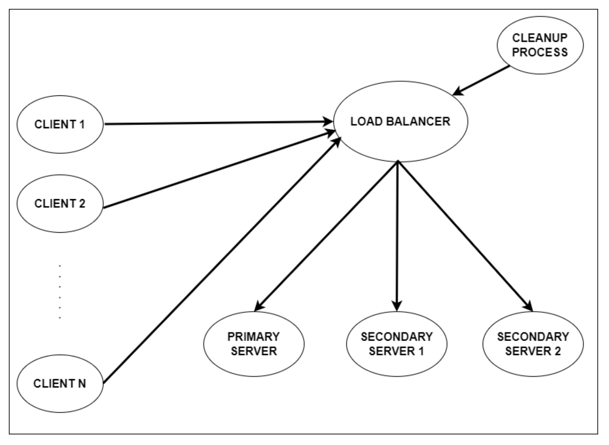

# Operating Systems : Distributed Graph Database System

 ## Contains:
- A load balancer process
- A primary server process
- Two secondary server processes (secondary server 1 and secondary server 2)
- A cleanup process
- Several clients

## Specifics
- Each odd request goes to SS 1, and even request goes to SS 2.
- The DBS can be both cyclic and acyclic. Graphs are unweighted and undirected.
- Each file contains the number of nodes followed by successive n lines containing the adjacency matrix.
- The operations that can be requsted by client are:
  - Add new graph to DB
  - Modify and existing graph
  - Perform DFS on an existing graph
  - Perform BFS on an exiting graph
- Multiple reads and single write is ensured using mutex.
